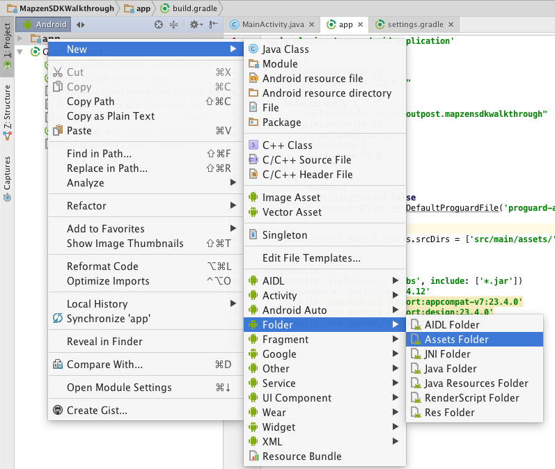

# Tangram Android SDK

There is a [good walkthrough](https://mapzen.com/documentation/tangram/android-walkthrough/) on getting a Tangram ES map working in Android via the Tangram Android SDK. 

One little _gotcha_ I found was adding the bubble wrap style to the app's assets. The instructions say to add:

```gradle
sourceSets.main.assets.srcDirs = ['../styles']
```

to the `build.gradle`, but that's not quite enough. Instead, I right clicked on the `app` folder and added an assets folder via a dialog. I did the default location, which is good, because this is the pattern I find in most apps. Now, the `build.gradle` file specifies the assets as:

```gradle
sourceSets { main { assets.srcDirs = ['src/main/assets/'] } }
```

Note that this is the `build.gradle (Module: app)`.



Now that we have created this directory, I put the [bubble-wrap project](https://github.com/tangrams/bubble-wrap) in that directory.

Also, the path to the scene file in the [tangram-android-demos](https://github.com/tangrams/tangram-android-demos) is incorrect. It really should be:

```java
view.getMapAsync(this, "bubble-wrap/bubble-wrap.yaml");
```

We do this same path with having the assets directory setup as described above.

My working SDK Walkthrough can be found here:

https://github.com/hallahan/MapzenSDKWalkthrough
